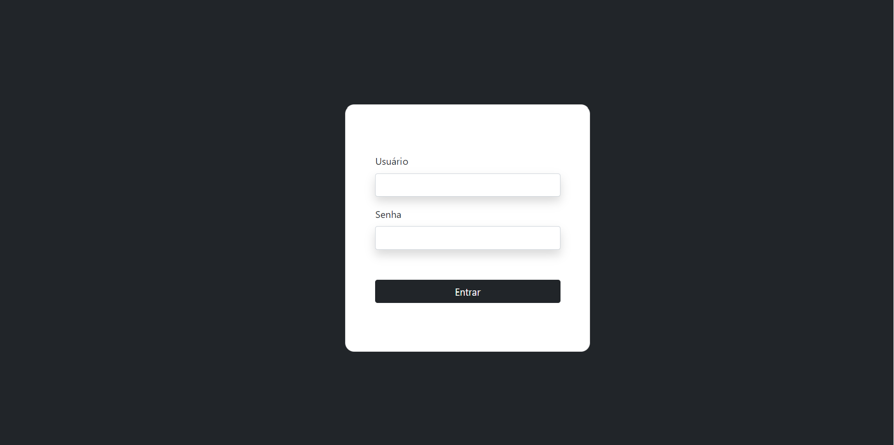
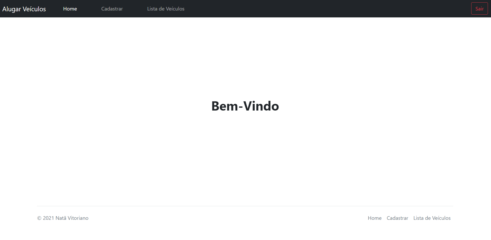
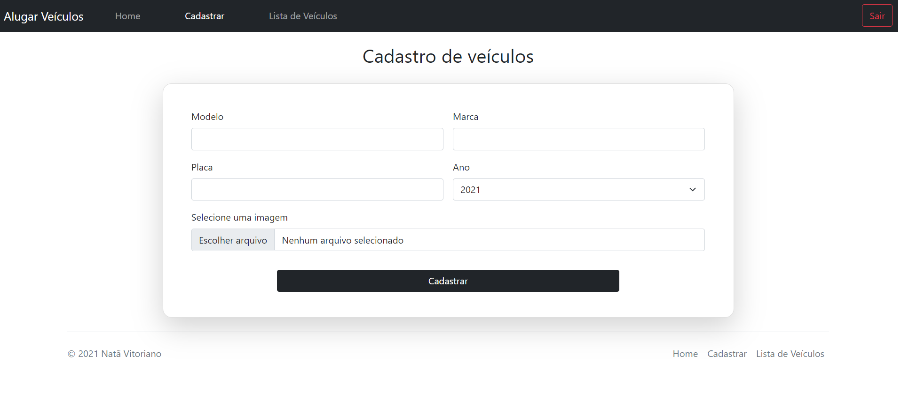
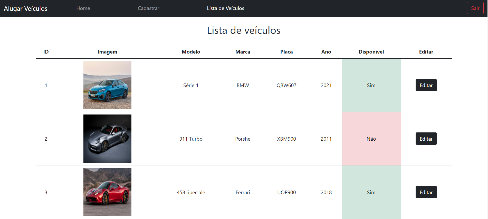

# Aluguel de veículos
> Página web para aluguel de veículos com login, cadastro e lista de veículos para aluguel.

## Indice
1. [Imagens do projeto](#imagens)
2. [Como rodar a aplicação](#comoRodar)
3. [Tecnologias utilizadas](#tecnologias)

### 1. Imagens do projeto

Login

Home

Cadastro

Lista de veículos

### 2. Como rodar a aplicação

No meu caso utilizo o [XAMPP](https://www.apachefriends.org/pt_br/index.html) para usar o apache e visualizar o código feito em PHP. Além também de já possuir o MySQL.

- Coloque os arquivos dentro da pasta de instalação do [XAMPP](https://www.apachefriends.org/pt_br/index.html) em htdocs, geralmente fica em ``(c:/xampp/htdoc)`` para que assim os arquivos sejam exibidos no localhost.

- Abrir o [XAMPP](https://www.apachefriends.org/pt_br/index.html) e clicar em start tanto no Apache como no MySQL.

- O arquivo ``rentcars.sql`` que vem na raiz do projeto é o Script do banco de dados MySQL, copie e execute ou importe o arquivo.

- O arquivo ``src/config/conn.inc`` possui as configurações do banco, se necessário abra-o para alterar o usuário ou senha de seu banco.

- Após as devidas configurações o projeto deve estar pronto para uso, lembrando que no arquivo do banco de dados já deixei cadastrado um usuário onde seu login e senha é ``admin``, caso queria é só inserir diretamente na ``tab_Users`` do banco um novo usuário para efetuar login no sistemas.

### 3. Tecnologias utilizadas

As seguintes ferramentas foram utilizadas na construção do projeto:

- [MySQL](https://www.mysql.com/)
- [PHP](https://www.mysql.com/)
- [Bootstrap](https://getbootstrap.com/)
- [jQuery](https://jquery.com/)

